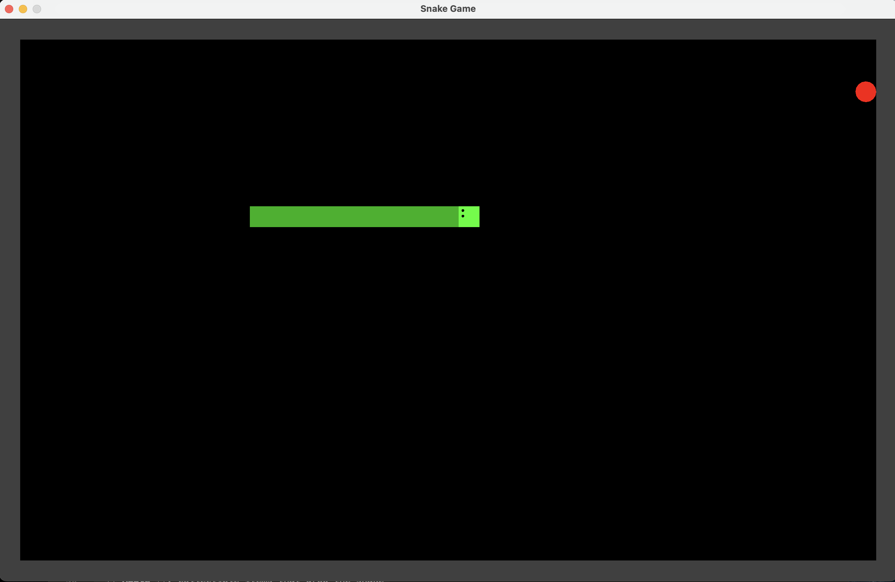

# Snake Game

A classic Snake game implementation in Java using Swing for the GUI. This project demonstrates object-oriented programming principles, the State pattern, and game development fundamentals.



## Features

- **Classic Snake Gameplay**: Control a snake to eat apples and grow longer
- **Collision Detection**: Game ends when the snake hits walls or itself
- **Restart Functionality**: Restart the game with a button after game over
- **Visual Feedback**: Snake head has directional eyes, different colors for head and body
- **Responsive Controls**: Smooth arrow key controls for movement

## Game Mechanics

- Snake starts moving to the right
- Use arrow keys to change direction
- Eat red apples to grow the snake and increase score
- Game ends when snake collides with walls
- Restart button appears on game over

## Architecture

The project follows a clean, object-oriented architecture with several key design patterns:

### Core Components

- **`Game`**: Main game window and event handling (Swing JPanel)
- **`Controller`**: Game logic coordinator and state manager
- **`GameState`**: Manages all game entities and their interactions
- **`GameEntity`**: Interface for all drawable game objects

### Snake Implementation

The snake uses a linked-list structure with the State pattern for movement:

- **`Head`**: Snake head with direction control and collision detection
- **`Body`**: Snake body segments that follow the head
- **`SnakePart`**: Abstract base class for all snake components

### Direction System

Movement is handled through the State pattern:

- **`Direction`**: Interface for movement states
- **`Left`, `Right`, `Up`, `Down`**: Concrete direction implementations
- Each snake part maintains its own direction state

### Game Objects

- **`Apple`**: Collectible items that grow the snake
- **`Wall`**: Boundary objects that end the game on collision
- **`Collidable`**: Interface for objects that can be collided with

## Technical Details

### Game Loop
- Uses Swing Timer for consistent 32ms game ticks (~31 FPS)
- Separates game logic updates from rendering

### Collision Detection
- Position-based collision system
- Handles apple collection and wall collision separately
- Snake growth is managed through the linked-list structure

### Rendering
- Custom paint methods for each game entity
- Coordinate system conversion for proper display
- Game over overlay with restart functionality

## Getting Started

### Prerequisites
- Java 8 or higher
- Java Development Kit (JDK)

### Running the Game

1. Clone or download the project
2. Compile the Java files:
   ```bash
   javac -d . snakegame/*.java snakegame/**/*.java
   ```
3. Run the game:
   ```bash
   java snakegame.Game
   ```

Alternatively, if using an IDE like IntelliJ IDEA or Eclipse:
1. Import the project
2. Run the `Game.java` main method

### Controls
- **Arrow Keys**: Change snake direction
- **Restart Button**: Restart game after game over (appears automatically)

## Project Structure

```
snakegame/
├── Game.java                    # Main game window and event handling
├── Controller.java              # Game logic and state management
├── DTO/
│   ├── GameEntity.java         # Interface for drawable game objects
│   └── GameState.java          # Game state management
├── Items/
│   ├── Apple.java              # Collectible apple objects
│   ├── Collidable.java         # Collision interface
│   └── Wall.java               # Boundary wall objects
└── Snake/
    ├── SnakeParts/
    │   ├── Head.java           # Snake head with controls
    │   ├── Body.java           # Snake body segments
    │   └── SnakePart.java      # Abstract snake component
    └── SnakeStates/
        ├── Direction.java      # Movement interface
        ├── Left.java           # Left movement state
        ├── Right.java          # Right movement state
        ├── Up.java             # Up movement state
        └── Down.java           # Down movement state
```

## Design Patterns Used

- **State Pattern**: For snake movement directions
- **Composite Pattern**: For snake body structure (linked list)
- **Strategy Pattern**: For collision handling
- **Observer Pattern**: Implicit in the game loop and event handling

## Configuration

Game settings can be modified in the `Game` class:
- `HEIGHT`: Game board height in tiles (default: 27)
- `WIDTH`: Game board width in tiles (default: 43)
- `TILESIZE`: Size of each tile in pixels (default: 30)
- Timer delay: Game speed in milliseconds (default: 32ms)

## Future Enhancements

Potential improvements that could be added:
- Score tracking and display
- High score persistence
- Difficulty levels (speed adjustment)
- Sound effects
- Different game modes
- Power-ups and special items
- Snake self-collision detection

## License

This project is open source and available under standard educational use terms.

## Contributing

This is an educational project demonstrating Java game development concepts. Feel free to fork and modify for learning purposes.